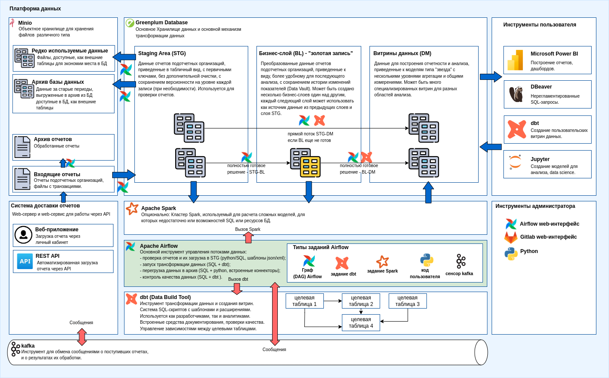

Архитектура
================

Диаграмма
----------

Компоненты
-----------

### Minio - объектное хранилище ###

Minio - open source реализация "облачного" объектного хранилища -
то есть хранилища файлов, структурированных в каталоги.
Реализация совместима с сервисом хранения файлов Amazon S3, сделана
по тем же принципам, для работы с Minio могут быть использованы
клиентские инструменты Amazon. Дополнительные мощности (ноды) для хранения файлов
можно добавлять по мере необходимости. С точки зрения пользователя
все ноды представляют собой один кластер - один большой диск,
или несколько кластеров - например - среду dev и среду prod.

В данном проекте объектное хранилище играет важную роль
и используется для хранения любых временных и постоянных файлов.
Поступающие файлы отчетов, большие файлы с транзакциями, файлы
с подписями поступают в объектное хранилище. Оттуда они
читаются системой интеграции данных (Airflow).

Объектное хранилище также используется, как расширение реляционной
базы данных (Greenplum). Структурированные файлы в формате parquet
или csv могут быть подключены к БД, как внешние таблицы и к ним
можно писать SQL-запросы так же, как к обычным таблицам, за исключением того,
что время чтения возрастает. Это позволяет разгрузить БД и держать
в объектном хранилище, например большие объемы транзакций за
предыдущие периоды или редко используемые данные.

### Greenplum - основная база данных ###

Greenplum - база данных построенная по принципам Massively Parallel Processing (MPP).
Представляет собой несколько баз данных PostgreSQL, объединенных в один кластер,
и способных распределять между собой нагрузку при обработке SQL-запросов.
В отличие от нескольких экземпляров PostgreSQL, развернутых параллельно,
Greenplum позволяет распределить одну таблицу (и отдельные ее поля) на разные ноды кластера,
некоторые таблицы - на все ноды кластера и таким образом гибко распределять обработку
сложных запросов. Использование Greenplum оправдвно, если ожидаемый размер БД превышает 10 ТБ,
и позволяет представить пользователям весь кластер, как одну единую базу данных,
в которой хранятся сотни терабайт, при этом можно соединять, группировать и фильтровать
данные из всех таблиц без ограничений.

Аналогами Greenplum являются такие облачные решения, как Amazon Redshift,
Google BigQuery, Microsoft Azure Dedicated SQL Pool, платформа Snowflake.
Однако все перечисленные платформы доступны только как облачные сервисы
и не могут быть развернуты на собственных мощностях, в отличие от Greenplum.

Часть таблиц Greenplum могут быть внешними - то есть файлами в объектном хранилище,
совместимом с протоколом Amazon S3 - Minio. Подключение к Minio производится непосредственно
из БД при помощи Greenplum Platform Extension Framework (PXF).
С точки зрения пользователя система представляет собой одну базу данных PostgreSQL,
к которой можно обращаться любыми инструментами, способными соединяться с БД 
обычным драйвером PostgreSQL.

Greenplum также используется как основной механизм обработки и преобразования данных.
Исходные отчеты и файлы с транзакциями парсятся и загружаются в таблицы БД (см. ниже) и
вся дальнейшая обработка, включая проверку качества данных, производится
внутри БД используя SQL по принципу ELT - Extract, Load, Transform.
Это позволяет значительно упростить обработку данных и привлечь к написанию
SQL-скриптов трансформации менее подготовленных специалистов, в том числе
самих пользователей - аналитиков, и таким образом снизить необходимые
объемы поддержки и сократить эксплуатационные расходы.

Greenplum разрабатывался, как open source продукт, но в настоящее время поставляется
и поддерживается компанией Broadcom и является платным продуктом.

### Apache Airflow - инструмент интеграции данных ###

Airflow - open source платформа для управления потоками данных, также
называемая "дата оркестратор", которая за последние годы стала стандартом
де-факто при построении хранилищ данных и систем подобного типа.

Airflow реализован на python как система серверных приложений:
scheduler, web-сервер для администрирования и произвольное количество
worker-процессов, которые запускаются на кластере из нескольких машин.

Airflow выполняет задания, называемые в его терминологии Data Acyclic Graph (DAG).
DAG - написанный на python скрипт, который декларативно описывает
шаги, которые должен предпринять Airflow. Каждый шаг - это вызов
т.н. "оператора" - компонента написанного на python, который производит
некоторую работу, например, подключиться к БД и выполнить SQL, скопировать файл,
подключиться к веб-сервису, проверить очередь сообщений, вызвать внешнюю программу.
Для большинства задач есть уже готовые операторы, поэтому написание Airflow DAG - 
это как правило просто декларация, написанная на питоне: вызвать один оператор,
затем второй, затем третий и четвертый параллельно.

Когда требуется расширить Airflow, нужно написать дополнительный оператор.
Например, в данном проекте потребуется разработать оператор, который позволит
разбирать отчет в формате XML или XBRL по формальным правилам, и загружать
результат в заданную таблицу базу данных. При появлении новых видов отчетов
новый оператор разрабатывать не требуется, нужно вызвать уже созданный,
передав ему другой набор параметров.
