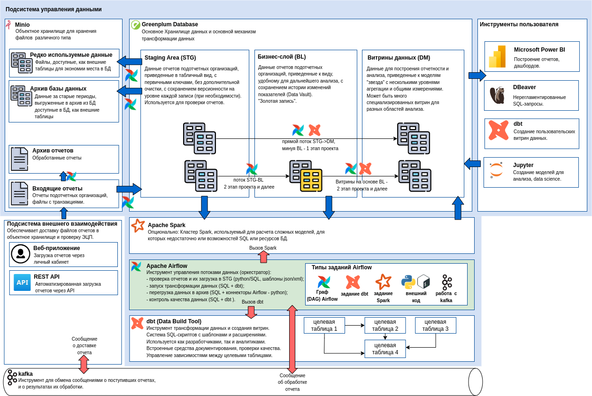

Архитектура
================

Диаграмма
----------

Компоненты
-----------

### Minio - объектное хранилище ###

Minio - open source реализация "облачного" объектного хранилища -
то есть хранилища файлов, структурированных в каталоги.
Реализация совместима с сервисом хранения файлов Amazon S3, сделана
по тем же принципам, для работы с Minio могут быть использованы
клиентские инструменты Amazon. Дополнительные мощности (ноды) для хранения файлов
можно добавлять по мере необходимости. С точки зрения пользователя
все ноды представляют собой один кластер - один большой диск,
или несколько кластеров - например - среду dev и среду prod.

В данном проекте объектное хранилище играет важную роль
и используется для хранения любых временных и постоянных файлов.
Поступающие файлы отчетов, большие файлы с транзакциями, файлы
с подписями поступают в объектное хранилище. Оттуда они
читаются системой интеграции данных (Airflow).

Объектное хранилище также используется, как расширение реляционной
базы данных (Greenplum). Структурированные файлы в формате parquet
или csv могут быть подключены к БД, как внешние таблицы и к ним
можно писать SQL-запросы так же, как к обычным таблицам, за исключением того,
что время чтения возрастает. Это позволяет разгрузить БД и держать
в объектном хранилище, например большие объемы транзакций за
предыдущие периоды или редко используемые данные.

### Greenplum - основная база данных ###

Greenplum - база данных построенная по принципам Massively Parallel Processing (MPP).
Представляет собой несколько баз данных PostgreSQL, объединенных в один кластер,
и способных распределять между собой нагрузку при обработке SQL-запросов.
В отличие от нескольких экземпляров PostgreSQL, развернутых параллельно,
Greenplum позволяет распределить одну таблицу (и отдельные ее поля) на разные ноды кластера,
некоторые таблицы - на все ноды кластера и таким образом гибко распределять обработку
сложных запросов. Использование Greenplum оправдвно, если ожидаемый размер БД превышает 10 ТБ,
и позволяет представить пользователям весь кластер, как одну единую базу данных,
в которой хранятся сотни терабайт, при этом можно соединять, группировать и фильтровать
данные из всех таблиц без ограничений.

Аналогами Greenplum являются такие облачные решения, как Amazon Redshift,
Google BigQuery, Microsoft Azure Dedicated SQL Pool, платформа Snowflake.
Однако все перечисленные платформы доступны только как облачные сервисы
и не могут быть развернуты на собственных мощностях, в отличие от Greenplum.

Часть таблиц Greenplum могут быть внешними - то есть файлами в объектном хранилище,
совместимом с протоколом Amazon S3 - Minio. Подключение к Minio производится непосредственно
из БД при помощи Greenplum Platform Extension Framework (PXF).
С точки зрения пользователя система представляет собой одну базу данных PostgreSQL,
к которой можно обращаться любыми инструментами, способными соединяться с БД 
обычным драйвером PostgreSQL.

Greenplum также используется как основной механизм обработки и преобразования данных.
Исходные отчеты и файлы с транзакциями парсятся и загружаются в таблицы БД (см. ниже) и
вся дальнейшая обработка, включая проверку качества данных, производится
внутри БД используя SQL по принципу ELT - Extract, Load, Transform.
Это позволяет значительно упростить обработку данных и привлечь к написанию
SQL-скриптов трансформации менее подготовленных специалистов, в том числе
самих пользователей - аналитиков, и таким образом снизить необходимые
объемы поддержки и сократить эксплуатационные расходы.

Greenplum разрабатывался, как open source продукт, но в настоящее время поставляется
и поддерживается компанией Broadcom и является платным продуктом.

### Apache Airflow - инструмент интеграции данных ###

Airflow - open source платформа для управления потоками данных, также
называемая "дата оркестратор", которая за последние годы стала стандартом
де-факто при построении хранилищ данных и систем подобного типа.

Airflow реализован на python как система серверных приложений:
scheduler, web-сервер для администрирования и произвольное количество
worker-процессов, которые запускаются на кластере из нескольких машин.

Airflow выполняет задания, называемые в его терминологии Data Acyclic Graph (DAG).
DAG - написанный на python скрипт, который декларативно описывает
шаги, которые должен предпринять Airflow. Каждый шаг - это вызов
т.н. "оператора" - компонента написанного на python, который производит
некоторую работу, например, подключиться к БД и выполнить SQL, скопировать файл,
подключиться к веб-сервису, проверить очередь сообщений, вызвать внешнюю программу.
Для большинства задач есть уже готовые операторы, поэтому написание Airflow DAG - 
это как правило просто декларация, написанная на питоне: вызвать один оператор,
затем второй, затем третий и четвертый параллельно.

Когда требуется расширить Airflow, нужно написать дополнительный оператор.
Например, в данном проекте потребуется разработать оператор, который позволит
разбирать отчет в формате XML или XBRL по формальным правилам, и загружать
результат в заданную таблицу базы данных. При появлении новых видов отчетов
новый оператор разрабатывать не требуется, нужно вызвать уже созданный,
передав ему другой набор параметров.

### dbt - инструмент трансформации данных ###

Data Build Tool (dbt) - инструмент для SQL-трансформации данных
внутри базы данных. Работает следующим образом:
пользователь пишет SQL-запрос, который выбирает нужный набор данных.
В терминах dbt это называется "модель". Запускает dbt engine (написан на python).
dbt engine создает целевую таблицу или обновляет в ней данные, используя
запрос, написанный пользователем. Правила обновления таблицы, описание полей,
первичные ключи, правила проверки корректности данных также могут быть заданы
пользователем в дополнительном текстовом файле в формате yaml.
SQL-запрос может содержать т.н. макросы - дополнительные переменные и выражения,
написанные на языке макросов jinja2, встроенного в dbt. При помощи макросов
можно задавать дополнительную логику, задавать значения глобальным переменным,
сконфигурированным в общем файле конфигурации, ссылаться на другие модели.
Ссылки на другие модели позволяют dbt построить зависимости между моделями,
и собирать их в правильном порядке. dbt может запускаться из командной строки
если он установлен на компьютер пользователя. Также dbt имеет собственный 
встроенный веб-сервер с веб-интерфейсом, который можно но необязательно использовать.
В промышленном режиме dbt engine устанавливается вместе с Airflow и вызывается из Airflow.

В этом случае измененные версии моделей dbt сохраняются пользователем
в git-репозиторий и устанавливаются на сервер в рамках автоматизированного процесса
Continuous Integration/Continuous Delivery (CI/CD).

Использование dbt позволяет облегчить процесс создания и администрирования витрин данных
и промежуточных таблиц в БД. dbt может использоваться также, как "супермаркет данных",
когда аналитик сам создает и тестирует модели, которые ему нужны, и впоследствии эти модели
интегрируютя в промышленный контур и используются другими пользователями
при минимальном участии службы поддержки.

В данном проекте dbt может использоваться для большей части обработки данных внутри БД.
Это позволяет стандартизовать обработку данных таким образом, что при появлении новых
отчетов подотчетных организыций или новых аналитических моделей не требуется
писать никакого дополнительного кода, кроме SQL-запросов, а всю техническую работу
низкого уровня выполняет dbt engine и Airflow.

dbt core распространяется, как open source инструмент (модули python),
поддерживается компанией dbt Labs за счет создания платных расширений к основной библиотеке
и создания облачной версии dbt, распространяемой как сервис.
Также существуют расширения к dbt, разрабатываемые независимыми компаниями.
Для реализации механизмов, описанных выше, требуются только базовые возможности dbt.

### Apache Spark - data science-калькулятор ###

Apache Spark - инструмент, который может заменить или дополнить ядро базы данных для
вычислений над большими наборами данных. Он реализован, как кластер из виртуальных машин,
в котором параллельно работают много рабочих процессов. Spark
читает данные или из файлов объектного хранилища или SQL-запросами из БД,
выполняет над ними преобразования, затем сохраняет получившийся набор данных
или в файлы или в таблицы БД. Преобразования могут быть написаны на языке SQL,
тогда Spark фактически работает, как обычная БД, или на языке python или java или
scala, тогда можно описать еще более сложные преобразования, недоступные в SQL.
Как правило, SQL 95% потребностей решается при помощи SQL.

Расчет задачи Spark занимает определенное время (минуты), поэтому Spark
не может заменить традиционную реляционную БД, по которой строятся интерактивные отчеты.
Однако Spark может быть использован, как калькулятор для тяжелых задач
data science и может записывать результаты расчетов обратно в таблицы БД.

В Spark отсутствует транзакционная целостность, реализованная в БД, поэтому
сложно реализовать систему, когда много процессов могут одновременно читать
данные из таблицы и писать данные в эту же таблицу. Поэтому трансформации данных,
как описано выше, проще делать в реляционной БД.
Spark показан на диаграмме как дополнительное средство увеличения возможностей
при нехватке ресурсов БД или возникновения сложных задач аналитики,
и на первом этапе его использование не требуется.

Вызов задания Spark делается из Airflow одним из нескольких готовых операторов,
доступных как open source. Сам проект Apache Spark также является open source,
существующим за счет компаний, использующих Spark внутри своих коммерческих продуктов.

### kafka - сервис очередей сообщений ###

